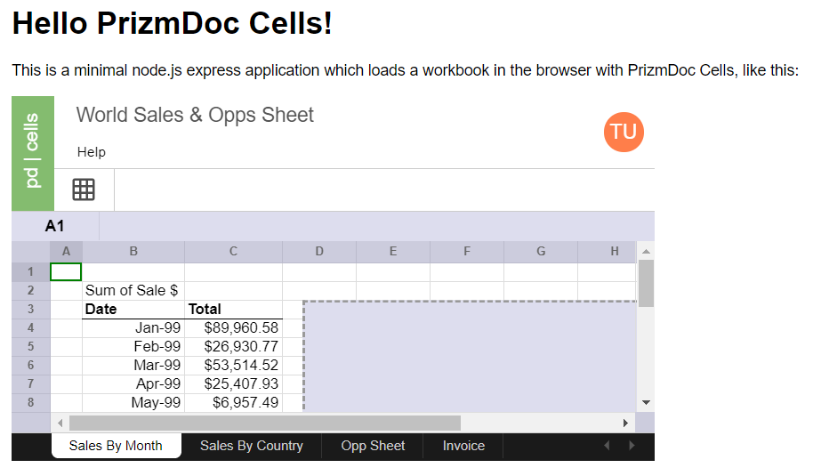

# Hello PrizmDoc Cells with node.js and HTML

A minimal node.js express app which has integrated PrizmDoc Cells.

## Setup

### Requirements

- [Node.js](https://nodejs.org) 8 or higher

### Configure Connection to PrizmDoc Cells

Configure how to connect to PrizmDoc Cells by editing the `config.json5` file (this is just a JSON file with comments).

For PrizmDoc Cloud:

```json
{
  "cellsServerBaseUrl": "https://api.accusoft.com/cells",
  "apiKey": "YOUR_API_KEY"
}
```

For self-hosted:

```json
{
  "cellsServerBaseUrl": "YOUR_CELLS_SERVER_BASE_URL",
}
```

Alternately, you can set or override any of these values via environment variables:

- `CELLS_SERVER_BASE_URL`
- `API_KEY`

### Install dependencies

```
npm install
```

## Running the Sample

To start the app:

```
npm start
```

This will launch a small web application on `http://localhost:8888`.

You should see output like this:

```
> node index.js

[HPM] Proxy created: /cells-server-proxy  ->  https://api.accusoft.com/cells
[HPM] Proxy rewrite rule created: "^/cells-server-proxy" ~> ""
[HPM] Subscribed to http-proxy events:  [ 'error', 'close' ]
Application running at http://localhost:8888
```

When you visit `http://localhost:8888`, you should see the contents of an XLSX
file inside of an interactive Workbook Control:


